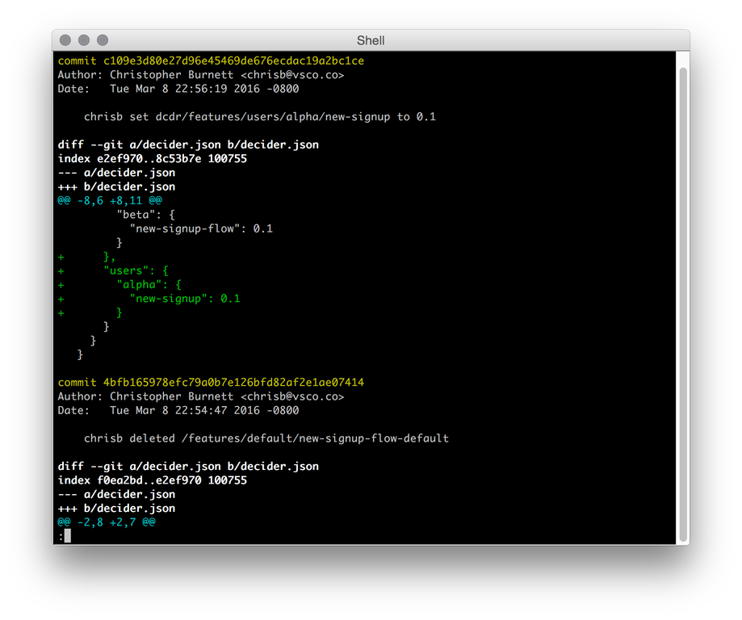
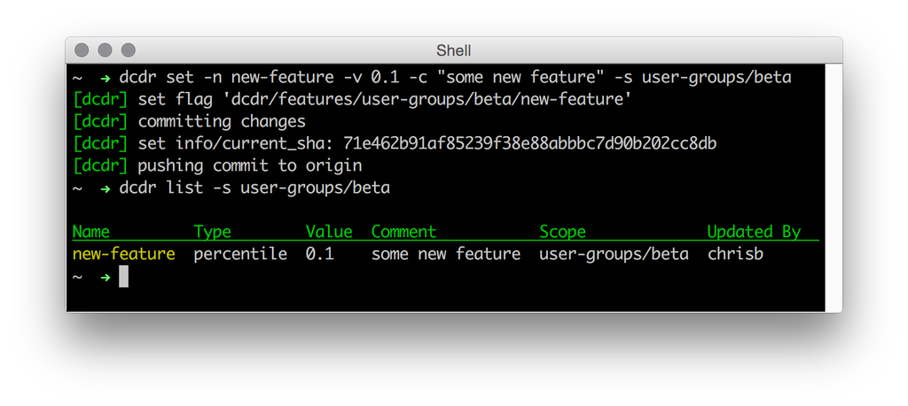
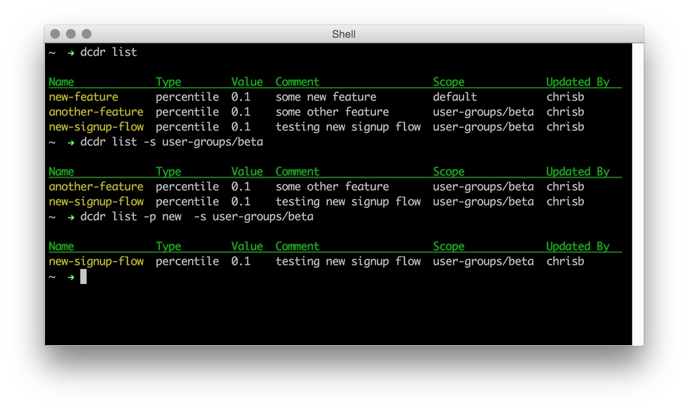
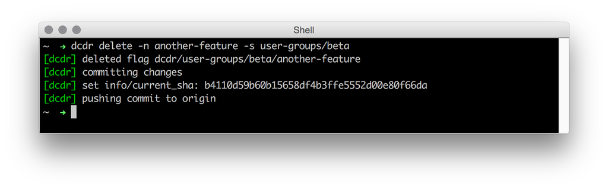
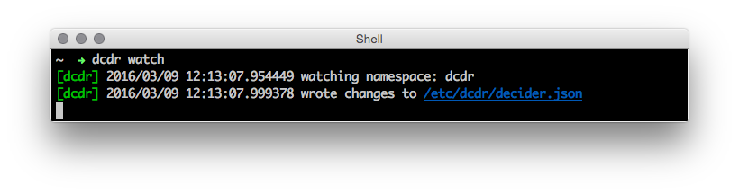
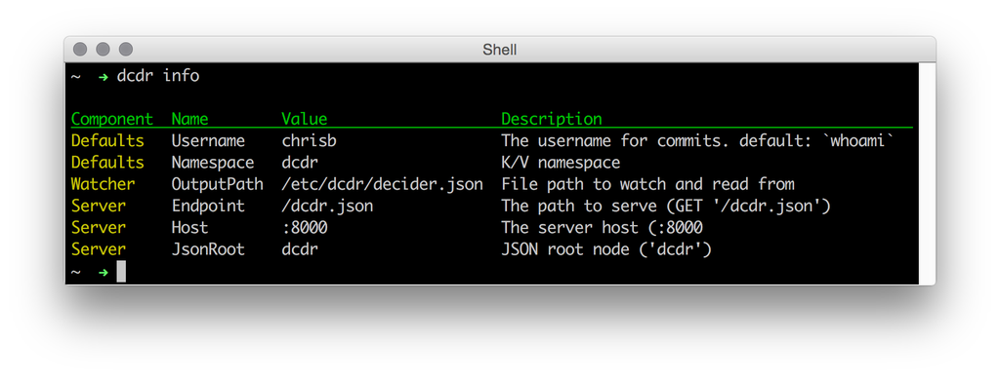

# dcdr (decider)
Distributed Feature Flags for the Consul K/V Store

## Overview

Decider is a [feature flag](https://en.wikipedia.org/wiki/Feature_toggle) system built using the [Consul Key/Value Store](https://www.consul.io/intro/getting-started/kv.html). It supports both `percentile` and `boolean` flags for controlled infrastructure rollouts and kill switches. 

Decider has three major components.

* A [`Client`](#using-the-go-client) for use within your Go applications
* The [`Server`](#decider-server) for accessing features over HTTP
* A [`CLI`](#cli) for managing features, watches, and starting the server

Each of these components are comprised of lower level libraries that you can use to to suit your systems specific needs.

### About Feature Flags

The two supported types of flags are `boolean` and `percentile`. These seem to be enough to cover most use cases for a system of this type. 

An example use case for a `boolean` flag would be an API kill switch that could alleviate load for a backing database.

```
disable-load-heavy-api-endpoint => true
```

In your code this would look something like this.

```Go
if dcdr.IsAvailable("disable-load-heavy-api-endpoint") {
	// All good, go about your day
} else {
	// DB is having a bad day, please check back later
}
```

Percentiles work much the same way but allow you to stress features or new infrastructure with a percentage of the request volume.

A common use case for `percentile` features would be stressing a new backend store with dual write percentage.

```
rollout-new-fancy-db-dual-write => 0.1
```

```Go
// Handle the write to the existing store 

if dcdr.IsAvailableForId("rollout-new-fancy-db-dual-write", user.Id) {
	// If the `user.Id` falls into 10% of requests do the dual write
}
```

These type of features have an added bonus as you may use thier `float64` values as scalars in cetertain cases.

Here we use the float value to scale the wait time for DB inserts between 0-1000ms.

```
 daemon-db-insert-wait-ms => 0.1
```

```Go
// waitMS would be 1000*0.1 => 100
waitMS := dcdr.ScaleValue("daemon-db-insert-wait-ms", 0, 1000)
time.Sleep(waitMS * time.Millisecond)
```

[Read more](#using-the-go-client) on how to use the client.

### Caveat

Feature flags and remote configuration are hard problems to solve in the general sense. Most organizations will have many corner cases unique to their own infrastructure and policies that are cumbersome to solve in an abstract way. Decider is an extracted set of flexible libraries that we at [VSCO](http://vsco.co) have developed over the past year that have worked well for us in solving these issues. 

This package does not set out to solve problems like authentication or ACLs for your features but It does aim to provide enough of the tooling and libraries so that you can do so yourself.

## Integrations

### Consul
Decider uses the built in commands from the [Consul](http://consul.io) CLI to distribute feature flags throughout your cluster. All Consul configuration environment variables are used to ensure that Decider can be used anywhere a `consul agent` can be run. Similar to the concepts introduced by [`consul-template`](https://github.com/hashicorp/consul-template). Decider observes a key prefix in the store and then writes the resulting key/value tree to a flat JSON file on any node running the `dcdr watch` command. Clients then observe this file using `fsnotify` and reload their internal feature maps accordingly.

### Scopes
In order to allow for expanding use cases and to avoid naming collisions, Decider provides arbitrary scoping of feature flags. An example use case would be providing separate features sets according to country code or mobile platform. Additionally, multiple Decider instances can be run within a cluster with separate namespaces and key sets by configuring [`config.hcl`](#configuration).

### Audit Trail
Due to the sensitive nature of configuration management, knowing the who, what, and when of changes can be very important. Decider uses `git` to handle this responsibility. By easily specifying a `git` repository and its origin in [`config.hcl`](#configuration), Decider will export your keyspace as a `JSON` file and then commit and push the changeset to the specified origin. Of course, this is all optional if you enjoy living dangerously.



### Observabilty 
It's nice to know when changes are happening. Decider can be configured to emit [Statsd](https://github.com/etsy/statsd) events when changes occur. Custom event tags can be sent as well if your collector supports them. Included in this package is a [DataDog](https://www.datadoghq.com/) adapter with Event and Tag support.

## Installation

* Install via `go get`
	* 	`go get -a github.com/vsco/dcdr`
* Install via release
	*  [https://github.com/vsco/dcdr/releases](https://github.com/vsco/dcdr/releases)
* Build from source

```
git clone git@github.com:vsco/dcdr.git
cd dcdr
script/bootstrap
script/install
```

Once installed on a machine running a `consul agent`, Decider is ready to connect to a default Consul host and port (localhost:8500) and begin writing to the K/V store. If you have a custom configuration for your agent, Decider will use the same [environment variables](https://github.com/hashicorp/consul/blob/master/api/api.go#L126) used to configure the Consul CLI.

## Getting Started

### CLI
The `dcdr` CLI has comprehensive help system for all commands.

```bash
dcdr help [command]" for more information about a command.
```

### Setting Features

Features have several fields that are accessible via `set` command.

```bash
	-n, --name="flag_name"
		the name of the flag to set
	-v, --value=0.0-1.0 or true|false
		the value of the flag
	-c, --comment="flag description"
		an optional comment or description
	-s, --scope="users/beta"
		an optional scope to nest the flag within
```

#### Example

```bash
dcdr set -n new-feature -v 0.1 -c "some new feature" -s user-groups/beta
```

The above command sets the key `dcdr/features/user-groups/beta/new-feature` equal to `0.1` and commits the update to the audit repo.



### Listing Features

Listing features can be filtered by a given `scope` and `prefix`. Any further fanciness can be handled by piping the output to `grep` or `less`.

```bash
	-p, --prefix="<flag-prefix>"
		List only flags with matching prefix.
	-s, --scope="<flag-scope>"
		List only flags within a scope.
```

#### Example

```bash
dcdr list -p new -s user-groups/beta
```



### Deleting Features

Features are removed using the `dcdr delete` command and take a `name` and `scope` parameters. If no `scope` is provided the `default` scope is assumed. Once deleted and if you have a repository configured, Decider will commit the changeset and push it to origin.

```
	-p, --prefix="<flag-prefix>"
		Name of the flag to delete
	-s, --scope="<flag-scope>"
		Optional scope to delete the flag from
```

#### Example

```
dcdr delete -n another-feature -s user-groups/beta
```



### Starting the Watcher

The `watch` command is central to how Decider features are distributed to nodes in a cluster. This command is a wrapper around `consul watch`. It observes the configured keyspace and writes a `JSON` file containing the exported structure to the configured [`Server:OutputPath`](#configuration).

By default the Decider configuration and watch path are located in `/etc/dcdr`. If this path does not exist you will need to create it.

```
 sudo mkdir /etc/dcdr
 sudo chown `whoami` /etc/dcdr
```

You can override this location by setting the `DCDR_CONFIG_DIR` environment variable. More on configuration can be found [here](#configuration).



## Tying the room together
If you need instructions for getting Consul installed, check their [Getting Started](https://www.consul.io/intro/getting-started/install.html) page.

Let's start a `consul agent` with an empty feature set and see how this all works together. For simplicity we can use the default Decider configuration without a git repository or stats.

```
consul agent -bind "127.0.0.1" -dev
```

This will start a local Consul agent ready to accept connections on `http://127.0.0.1:8500`. Decider should now be able to connect to this instance and set features.

####Set some features

```
# check that we can talk to the local agent
~  → dcdr list
[dcdr] no feature flags found in namespace: dcdr

# set a feature into the 'default' scope.
~  → dcdr set -n example-feature -v false
[dcdr] set flag 'dcdr/features/default/example-feature'

# set a feature into the 'user-groups/beta' scope.
~  → dcdr set -n example-feature -v true -s user-groups/beta
[dcdr] set flag 'dcdr/features/user-groups/beta/example-feature'

~  → dcdr list

Name             Type     Value  Comment  Scope             Updated By
example-feature  boolean  false           default           chrisb
example-feature  boolean  true            user-groups/beta  chrisb
```
Here we have set the feature `example-feature` into two separate scopes. In the 'default' scope the value is `false` and in the 'user-groups/beta' scope it has been set to true.

##### Start the watcher and observe changes

```
# start the watcher
~  → dcdr watch
[dcdr] 2016/03/09 17:56:17.250948 watching namespace: dcdr
[dcdr] 2016/03/09 17:56:17.365362 wrote changes to /etc/dcdr/decider.json
```
The watcher is now observing your <Namespace> and writing all changes to the [`Server:OutputPath`](#configuration) ( default `/etc/dcdr/decider.json`).

### Decider Server
The easiest way to view your feature flags is with `dcdr server`. This is a bare bones implementation of how to access features over HTTP. There is no authentication, so unless your use case is for internal access only you should include the `server` package into a new project and assemble your own. The server is built with the [Goji](https://github.com/zenazn/goji) framework and is extensible by adding additional middleware. Read more on custom servers [here](#building-a-custom-server).

```
# start the server
~  → dcdr server
[dcdr] started watching /etc/dcdr/decider.json
[dcdr] 2016/03/09 18:03:46.211150 serving /dcdr.json on :8000
```
The server is now running on `:8000` and features can be accessed by curling `:8000/dcdr.json`. In order to access your scopes the server accepts a `x-dcdr-scopes` header. This is a comma-delimited, priority-ordered list of scopes. Meaning that the scopes should provided with the highest priority first. For now we only have one scope so let's start simple.

```
# curl with no scopes
~  → curl -s :8000/dcdr.json
{
  "info": {},
  "dcdr": {
    "example-feature": false
  }
}
```
Here we see that the default value of false is returned. The `info` key is where information  like the current SHA of the repository would be if one was configured. Next, if we add the scope header we can access our scoped values.

```
~  → curl -sH "x-dcdr-scopes: user-groups/beta" :8000/dcdr.json
{
  "dcdr": {
    "info": {},
    "features": {
      "example-feature": true
    }
  }
}
```

## Using the Go client

Included in this package is a Go client. By default this client uses the same [`config.hcl`](#configuration) for its configuration. You may also provide custom your own custom configuration as well using `config.Config` and the `client.New` method. For this example we will assume the defaults are still in place and that the features from the above example have been set.

### Require and initialize the client

```Go
import "github.com/vsco/dcdr/client"

// Initialize a client with the default configuration
client := client.NewDefault()

// Begin watching the decider.json file
err := client.Watch()

if err != nil {
	panic(err)
}
```

### Checking feature flags

The client has three main methods for interacting with flags `IsAvailable(feature string)`. `IsAvailableForId(feature string, id uint64)`, and `ScaleValue(feature string, min float64, max float64)`.

#### IsAvailable

This method is for checking `boolean` features or 'kill switches'. If a `percentile` feature is passed to this method it will always return false. So don't do that.

```
# set the default feature
dcdr set -n example-feature -v false
```

```Go
// Using the fluent API for brevity
client, err := client.NewDefault().Watch()

if err != nil {
	panic(err)
}

// example-feature would be false
if client.IsAvailable("example-feature") {
	fmt.Println("example-feature enabled")
} else {
	fmt.Println("example-feature disabled")
}
```

This example initializes a new `Client` and begins watching the 'default' feature scope. It then checks the `example-feature` and runs the appropriate code path given the current value of the feature.

#### So what about scopes?

To initialize a Decider `Client` into a given set of scopes use the `WithScopes(scopes ...string)` method. This method creates a new `Client` with an underlying feature set that has the provided `scope` values merged onto the default set. If a feature does not exist in any of the provided scopes the client will fallback to the 'default' `scope` to find the value. If the feature does not exist in any scope the client simply returns `false`. 

```
# set the scoped feature
dcdr set -n example-feature -v true -s user-groups/beta
```

```Go
client, err := client.NewDefault().Watch()
scopedClient := client.WithScopes("user-groups/beta")

if err != nil {
	panic(err)
}

// example-feature would be true
if scopedClient.IsAvailable("example-feature") {
	fmt.Println("example-feature enabled")
} else {
	fmt.Println("example-feature disabled")
}
```

#### Fallbacks

```
# set a feature that does not exist in user-groups/beta
dcdr set -n another-feature -v true
```

```Go
client, err := client.NewDefault().Watch()
scopedClient := client.WithScopes("user-groups/beta")

if err != nil {
	panic(err)
}

// another-feature would be true
if scopedClient.IsAvailable("another-feature") {
	fmt.Println("another-feature enabled")
} else {
	fmt.Println("another-feature disabled")
}
```

### IsAvailableForId

This method works exactly as `IsAvailable` except that it is used for enabling features for only a fraction of requests. Both the `feature` string and `id` are hashed together using `hash/crc32` to create an integer that is used with the `float64` value of a `percentile` feature to determine the enabled state. The code for this functionality can be found [here](https://github.com/vsco/dcdr/blob/master/client/client.go#L223).

#### Using percentiles

```
# set a feature to 50%
dcdr set -n new-feature-rollout -v 0.5
```

```Go
client, err := client.NewDefault().Watch()

if err != nil {
	panic(err)
}

userId := unint64(5)

// new-feature-rollout would be true
if client.IsAvailableForId("new-feature-rollout", userId) {
	fmt.Println("new-feature-rollout enabled")
} else {
	fmt.Println("new-feature-rollout disabled")
}
```

### ScaleValue

`ScaleValue` uses the same `float64` values as `IsAvailableForId` but in this case these values are used to obtain a new value scaled between a `min` and a `max`.

For instance:

Given the feature `db-insert-wait-ms => 0.5`. When provided to the `ScaleValue` method would result in the following.

```Go
for {
	insertWaitMs := dcdr.ScaleValue("db-insert-wait-ms", 0, 1000)
	time.Sleep(insertWaitMs * time.Millisecond) // waits for 500ms

	db.Insert("some-value")
}
```

## Building a custom Server

Exposing your feature flags to the open internet would be a terrible idea in most cases. The default server will work fine as long as access is restricted to internal network clients but what if we want to allow access to mobile devices? Since there are entirely too many auth strategies to cover and we are kind of lazy, Decider `Server` allows you to add middleware to customize its behavior to suit your authentication needs.

### Extending with middleware

Below is an example of how to do authentication very poorly. However, if you look close enough you can imagine exactly where you might add a DB lookup for an OAuth token or something similar. The `Use` method takes variadic `MiddlewareType` as a param to allow chainable customizations.

```Go
const AuthorizationHeader = "Authorization"

// MockAuth example authentication middleware.
// Checks for any value in the http Authorization header.
// If no value is found a 401 status is sent.
func MockAuth(c *web.C, h http.Handler) http.Handler {
	fn := func(w http.ResponseWriter, r *http.Request) {
		if r.Header.Get(AuthorizationHeader) != "" {
			h.ServeHTTP(w, r)
		} else {
			w.WriteHeader(http.StatusUnauthorized)
		}
	}

	return http.HandlerFunc(fn)
}

func main() {
	// Create a new Server and Client
	srv := server.NewDefault()

	// Add the MockAuth to the middleware chain
	srv.Use(MockAuth)

	// Begin serving on :8000
	// curl -sH "Authorization: authorized" :8000/dcdr.json
	srv.Serve()
}
```

Here is a bit more useful example. This `ScopedCountryCode` middleware takes the `X-Country` header and appends it to `x-dcdr-scopes`. We then use the `country-code/<cc>` scope to look up per country feature flags from the K/V store.

```Go
const CountryCodeHeader = "X-Country"
const DcdrScopesHeader = "x-dcdr-scopes"

func ScopedCountryCode(c *web.C, h http.Handler) http.Handler {
	fn := func(w http.ResponseWriter, r *http.Request) {
		cc := strings.ToLower(r.Header.Get(CountryCodeHeader))

		if cc != "" {
			// Check for existing scopes and append 'country-code/xx'
			scopes := strings.Split(r.Header.Get(DcdrScopesHeader), ",")
			scopes = append(scopes, fmt.Sprintf("country-codes/%s", cc))
			r.Header.Set(DcdrScopesHeader, strings.Join(scopes, ","))
		}

		h.ServeHTTP(w, r)
	}

	return http.HandlerFunc(fn)
}
```

A full working example can be found in [server/demo/main.go](https://github.com/vsco/dcdr/blob/master/server/demo/main.go).

## Configuration

All configuration lives in `config.hcl`. By default Decider looks for this file in `/etc/dcdr/config.hcl`. You will need to create the `/etc/dcdr` directory. Your permissions depending on the machine may differ but to get started locally do the following. 

```
 sudo mkdir /etc/dcdr
 sudo chown `whoami` /etc/dcdr
 dcdr init
```

The default config path can also be overriden by setting the `DCDR_CONFIG_PATH` environment variable to a location of your choosing.

Running `dcdr init` will create a default config file for you if one does not already exist. Once you have edited this file with your, statsd, and git repo configurations you can view this info by running the `dcdr info` command.

To create a new repository from scratch. Configure the `config.hcl` file with your `RepoPath` and `RepoURL` and then run `dcdr init --create`. This will create the repo add an empty `JSON` file and attempt to push it to the specified origin.



### Example config.hcl

```
Username = "twoism"
Namespace = "dcdr"

Watcher {
  OutputPath = "/etc/dcdr/decider.json"
}

Server {
  JsonRoot = "dcdr"
  Endpoint = "/dcdr.json"
}

Git {
  RepoURL = "git@github.com:vsco/decider-test-config.git"
  RepoPath = "/etc/dcdr/audit"
}

Stats {
  Namespace = "decider"
  Host = "127.0.0.1"
  Port = 8126
}
```


